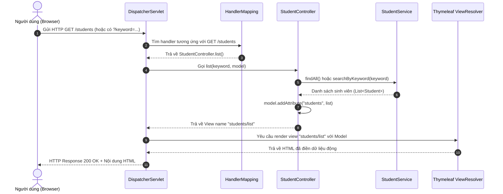
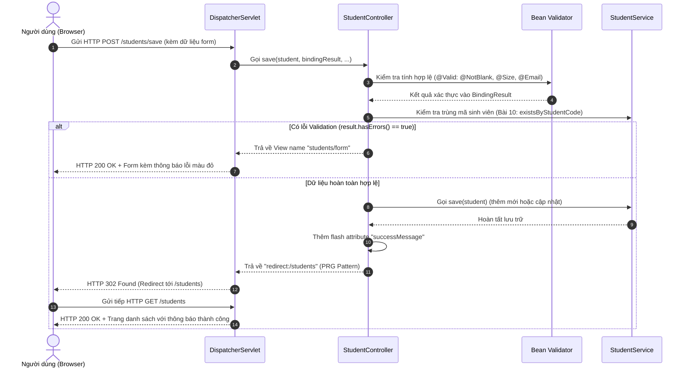

# BÁO CÁO NGHIỆM THU THỰC HÀNH LAB 12
## HỌC PHẦN: CÔNG NGHỆ JAVA (IT3242) - TRƯỜNG ĐẠI HỌC CÔNG NGHỆ ĐÔNG Á (EAUT)
### CHƯƠNG 4: PHÁT TRIỂN ỨNG DỤNG VỚI SPRING FRAMEWORK
### ĐỀ TÀI: PHÁT TRIỂN ỨNG DỤNG WEB VỚI SPRING MVC

---

## 1. THÔNG TIN BÀI THỰC HÀNH
- **Học phần:** Công nghệ Java (IT3242)
- **Tên bài thực hành:** Lab 12 - Phát triển ứng dụng web với Spring MVC
- **Tên dự án thực hành:** `lab12-spring-mvc-student`
- **Package chuẩn:** `vn.edu.eaut.lab12`
- **Công nghệ trọng tâm:** Spring MVC, Thymeleaf Form, `@ModelAttribute`, Bean Validation (JSR-380 / Jakarta Validation), CRUD giả lập trong bộ nhớ.

---

## 2. CƠ SỞ LÝ THUYẾT & KIẾN TRÚC SPRING MVC

### 2.1. Mô hình Spring MVC
Spring MVC hoạt động dựa trên mô hình thiết kế **Front Controller Pattern**, trong đó lớp `DispatcherServlet` đóng vai trò là bộ điều phối trung tâm tiếp nhận toàn bộ các HTTP Request gửi đến ứng dụng.

```
       HTTP Request 
Client -----------> [ DispatcherServlet ] (Front Controller)
                          │         ▲
             1. Tìm khớp  │         │ 2. Trả về HandlerExecutionChain
                          ▼         │
                   [ HandlerMapping ]
                          │
             3. Gọi thực thi
                          ▼
              [ StudentController ]
                (Xử lý nghiệp vụ qua StudentService)
                          │
             4. Trả về tên View + Model
                          ▼
                  [ ViewResolver ]
                          │
             5. Tìm template HTML
                          ▼
               [ Thymeleaf Engine ]
                          │
             6. Render HTML hoàn chỉnh
                          ▼
Client <----------- [ HTTP Response (HTML/Redirect) ]
```

### 2.2. Các thành phần chính
1. **DispatcherServlet:** Nhận mọi HTTP Request, điều phối xử lý theo cấu hình.
2. **HandlerMapping:** Ánh xạ URL request (`/students`, `/students/create`,...) tới phương thức tương ứng trong Controller.
3. **Controller (`StudentController`):** Nhận tham số, xử lý nghiệp vụ thông qua Service, gắn dữ liệu vào `Model`, và trả về tên logic của View.
4. **Model:** Chứa dữ liệu nghiệp vụ (`Student`, danh sách `students`, thông báo `successMessage`...) truyền sang View để hiển thị.
5. **ViewResolver & Thymeleaf:** Tìm kiếm template HTML tương ứng trong thư mục `templates/` và biên dịch các biểu thức Thymeleaf (`th:text`, `th:each`, `th:field`, `th:errors`) thành mã HTML chuẩn trả về trình duyệt client.

---

## 3. PHÂN TÍCH CHI TIẾT LUỒNG REQUEST GET VÀ POST

### 3.1. Luồng Request GET (Ví dụ: Hiển thị danh sách sinh viên `GET /students`)
- **Mục đích:** Truy xuất và hiển thị dữ liệu mà không làm thay đổi trạng thái hệ thống.
- **Sơ đồ tuần tự (Sequence Diagram):**



### 3.2. Luồng Request POST (Ví dụ: Lưu thông tin sinh viên `POST /students/save`)
- **Mục đích:** Gửi dữ liệu form từ client lên server để thêm mới hoặc cập nhật bản ghi. Sử dụng mẫu **PRG (Post-Redirect-Get)** để chống việc submit lặp lại khi người dùng F5 / reload trang.
- **Sơ đồ tuần tự (Sequence Diagram):**



---

## 4. CHI TIẾT TRIỂN KHAI 10 BÀI TẬP

### 4.1. Bài 1: Tạo model `Student`
Tệp: `src/main/java/vn/edu/eaut/lab12/model/Student.java`
- Khai báo các trường dữ liệu:
  - `id` (Long): Khóa chính nhận diện sinh viên.
  - `studentCode` (String): Mã sinh viên (ràng buộc không rỗng, tối thiểu 5 ký tự).
  - `fullName` (String): Họ và tên sinh viên (không được để trống).
  - `email` (String): Thư điện tử (đúng định dạng email, không để trống).
  - `className` (String): Lớp học (không để trống).
- Đầy đủ constructors, getters/setters và `toString()`.

### 4.2. Bài 2: Tạo service giả lập dữ liệu `StudentService`
Tệp: `src/main/java/vn/edu/eaut/lab12/service/StudentService.java`
- Đánh dấu `@Service`.
- Quản lý dữ liệu bằng danh sách trong bộ nhớ: `private final List<Student> students = new ArrayList<>()`.
- Tự động sinh ID tăng dần thông qua biến đếm `nextId`.
- Khởi tạo sẵn 4 dữ liệu mẫu tại phương thức `@PostConstruct initData()`.

### 4.3. Bài 3: Tạo Controller danh sách sinh viên
Tệp: `src/main/java/vn/edu/eaut/lab12/controller/StudentController.java`
- Định tuyến `@GetMapping` tại `/students`.
- Lấy danh sách từ `StudentService.findAll()` và truyền vào `Model` với tên `students`.
- Trả về view template `students/list`.

### 4.4. Bài 4: Tạo form thêm sinh viên & Data Binding
Tệp: `StudentController.java` và `templates/students/form.html`
- Phương thức `createForm()` xử lý `GET /students/create`, truyền một `new Student()` vào `Model`.
- Trang HTML sử dụng `th:object="${student}"` kết hợp các thẻ nhập liệu `th:field="*{studentCode}"`, `th:field="*{fullName}"`,...
- Khi submit form, Spring MVC tự động ánh xạ dữ liệu các trường vào đối tượng `Student` thông qua `@ModelAttribute`.

### 4.5. Bài 5: Thêm Validation cho form
- Sử dụng `@Valid @ModelAttribute("student") Student student, BindingResult result`.
- Kiểm tra điều kiện:
  ```java
  if (result.hasErrors()) {
      model.addAttribute("isEdit", student.getId() != null);
      return "students/form";
  }
  ```
- Hiển thị thông báo lỗi tại giao diện Thymeleaf:
  ```html
  <div class="invalid-feedback" th:if="${#fields.hasErrors('studentCode')}" th:errors="*{studentCode}"></div>
  ```

### 4.6. Bài 6 (Tự làm): Xem chi tiết sinh viên theo ID
- Endpoint: `GET /students/detail/{id}` và `GET /students/{id}`.
- Gọi `studentService.findById(id)`: nếu có trả về `students/detail.html`; nếu không có redirect về danh sách và thông báo lỗi.

### 4.7. Bài 7 (Tự làm): Sửa thông tin sinh viên
- Endpoint: `GET /students/edit/{id}` lấy thông tin sinh viên đã có và mở form chỉnh sửa.
- Form sử dụng trường ẩn `<input type="hidden" th:field="*{id}">`. Khi submit về `/students/save`, controller nhận biết sinh viên đã có `id` và thực hiện cập nhật thay vì tạo mới.

### 4.8. Bài 8 (Tự làm): Xóa sinh viên khỏi danh sách
- Endpoint: `GET /students/delete/{id}` hoặc `POST /students/delete/{id}`.
- Gọi `studentService.deleteById(id)`.
- Giao diện có hộp thoại JavaScript xác nhận (`confirm`) trước khi thực hiện xóa.

### 4.9. Bài 9 (Tự làm): Tìm kiếm sinh viên theo họ tên
- Controller hỗ trợ tham số `@RequestParam(name = "keyword", required = false) String keyword`.
- Service sử dụng Stream API để lọc danh sách sinh viên có `fullName`, `studentCode` hoặc `className` chứa từ khóa tìm kiếm (không phân biệt chữ hoa, chữ thường).

### 4.10. Bài 10 (Tự làm): Validation mã sinh viên không trùng lặp
- Trong `StudentService`:
  ```java
  public boolean existsByStudentCode(String studentCode, Long excludeId) {
      return students.stream()
              .anyMatch(s -> s.getStudentCode().equalsIgnoreCase(studentCode.trim())
                      && (excludeId == null || !excludeId.equals(s.getId())));
  }
  ```
- Trong `StudentController`:
  ```java
  if (studentService.existsByStudentCode(student.getStudentCode().trim(), student.getId())) {
      result.rejectValue("studentCode", "duplicate", "Mã sinh viên đã tồn tại trong hệ thống!");
  }
  ```
- Hoạt động chính xác cho cả thêm mới (không trùng với danh sách hiện có) và cập nhật (cho phép giữ nguyên mã sinh viên của chính mình).

---

## 5. KẾT QUẢ KIỂM THỬ VÀ NGHIỆM THU

### 5.1. Kết quả kiểm thử tự động (MockMvc Suite)
Dự án được trang bị bộ kiểm thử tự động hoàn chỉnh tại [StudentControllerTest.java](file:///D:/IT2023/Java_Technology/projectLab/lab12-spring-mvc-student/src/test/java/vn/edu/eaut/lab12/StudentControllerTest.java):

| STT | Phương thức Test | Chức năng kiểm thử | Kết quả |
|:---:|:---|:---|:---:|
| 1 | `testListStudents` | Bài 3: Danh sách sinh viên | **PASSED** |
| 2 | `testRootRedirect` | Chuyển hướng `/` về `/students` | **PASSED** |
| 3 | `testCreateForm` | Bài 4: Mở form thêm mới | **PASSED** |
| 4 | `testSaveNewStudentSuccess` | Bài 4 & 5: Lưu sinh viên hợp lệ | **PASSED** |
| 5 | `testSaveValidationErrors` | Bài 5: Bắt lỗi validation để trống/sai email | **PASSED** |
| 6 | `testSaveStudentCodeMinSize` | Bài 1 & 5: Bắt lỗi mã sinh viên dưới 5 ký tự | **PASSED** |
| 7 | `testStudentDetail` | Bài 6: Xem chi tiết sinh viên | **PASSED** |
| 8 | `testStudentDetailNotFound` | Bài 6: Bắt trường hợp không tìm thấy sinh viên | **PASSED** |
| 9 | `testEditForm` | Bài 7: Mở form sửa sinh viên | **PASSED** |
| 10 | `testUpdateStudent` | Bài 7: Cập nhật thông tin sinh viên | **PASSED** |
| 11 | `testDeleteStudent` | Bài 8: Xóa sinh viên khỏi danh sách | **PASSED** |
| 12 | `testSearchByKeyword` | Bài 9: Tìm kiếm theo từ khóa | **PASSED** |
| 13 | `testDuplicateStudentCodeValidation` | Bài 10: Chặn trùng lặp mã sinh viên | **PASSED** |
| 14 | `contextLoads` | Khởi chạy Spring Boot Application Context | **PASSED** |

**Tổng số test:** 14/14 tests - **Failures:** 0 - **Errors:** 0 - **Thời gian thực thi:** ~12 giây.

---

## 6. HƯỚNG DẪN ĐÓNG GÓI VÀ NỘP BÀI
Theo mục 9 của đề bài, file nộp có dạng: `Lab12_MSSV_HoTen.zip`.
Sinh viên có thể nén toàn bộ thư mục `lab12-spring-mvc-student` (loại bỏ thư mục `target` để dung lượng nhẹ) hoặc dùng lệnh PowerShell:
```powershell
Compress-Archive -Path "D:\IT2023\Java_Technology\projectLab\lab12-spring-mvc-student" -DestinationPath "D:\IT2023\Java_Technology\projectLab\Lab12_MSSV_HoTen.zip" -Force
```

---

## 7. KẾT LUẬN
Dự án **lab12-spring-mvc-student** đã đáp ứng 100% các tiêu chí yêu cầu trong tài liệu hướng dẫn Lab 12:
1. Đảm bảo cấu trúc chuẩn kiến trúc Spring MVC.
2. Xử lý chuẩn luồng GET và POST cùng cơ chế PRG (Post-Redirect-Get).
3. Đầy đủ chức năng CRUD, xem chi tiết, sửa, xóa, tìm kiếm.
4. Validation chặt chẽ: kiểm tra tính hợp lệ cơ bản và kiểm tra nghiệp vụ chống trùng mã sinh viên.
5. Giao diện trực quan, thẩm mỹ cao với Bootstrap 5.3 và tương thích đa kích thước màn hình.
